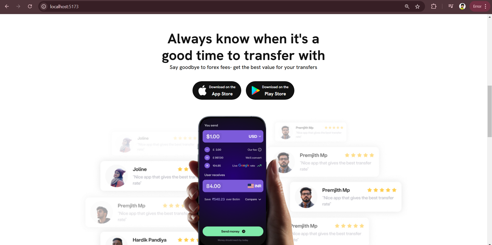
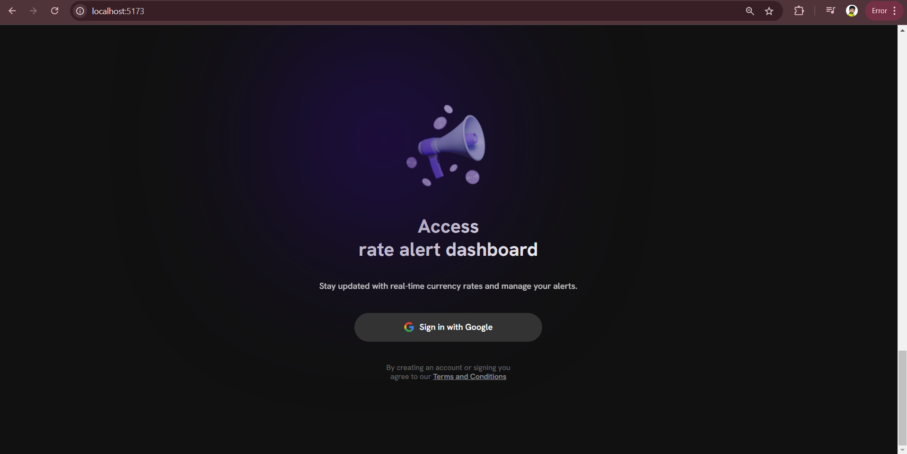
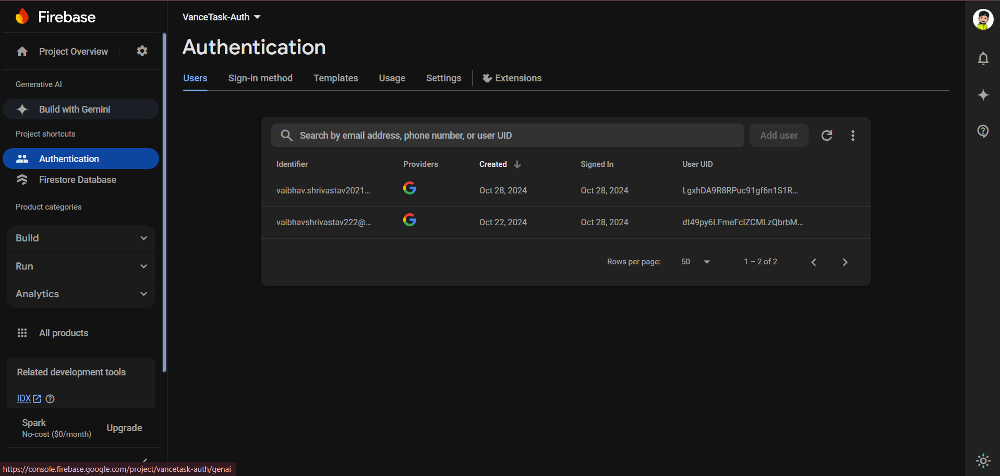
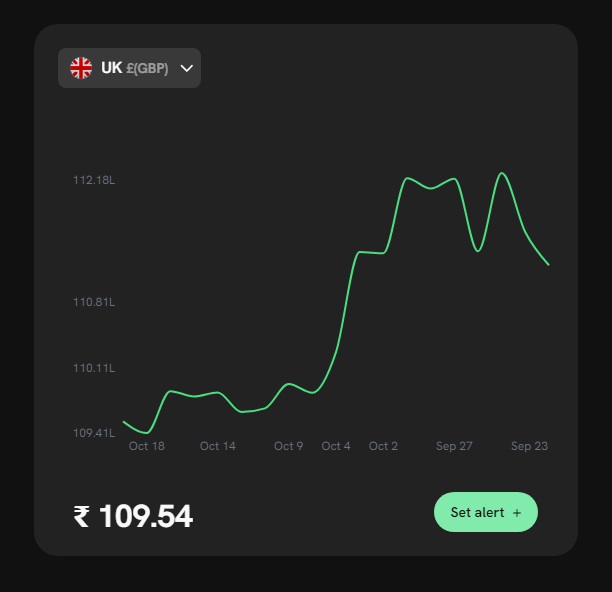
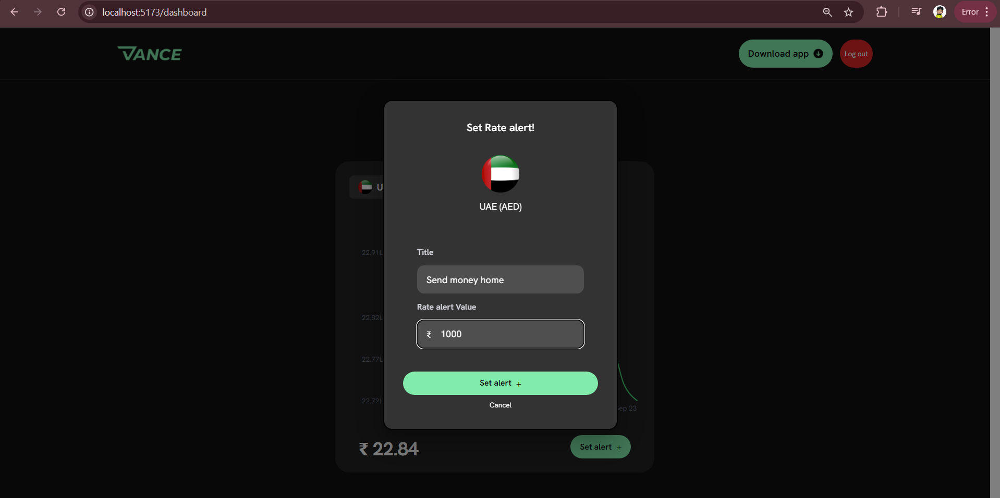
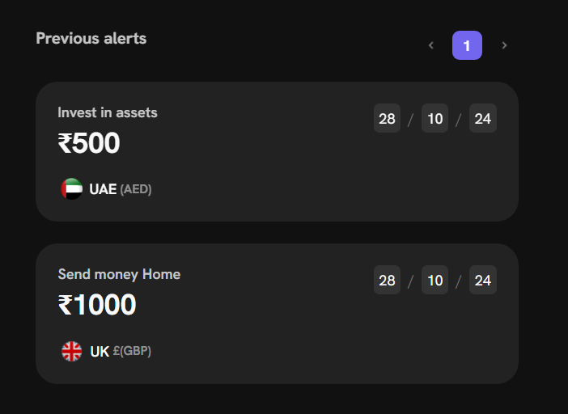

# Currency Exchange Rate Alert Application

The Currency Exchange Rate Alert Application allows users to monitor and receive alerts for currency exchange rates between the UK (GBP) and UAE (AED). The application features an interactive dashboard with real-time exchange rate visualizations, user authentication, and alert management.

## Table of Contents

1. [Technologies](#technologies)
2. [Features](#features)
3. [Implementation Details](#implementation-details)
4. [Deployment](#deployment)
5. [Getting Started](#getting-started)


## Technologies
- **Frontend**: React, TailwindCSS, Material-UI (MUI)
- **Backend**: Express (for proxy server)
- **Database**: Firebase (Cloud FireStore)
- **Charting**: Recharts for data visualization
- **Animation**: GSAP for landing page animations

## Features
- **Landing Page**: Engaging landing page with animations using GSAP.

- **User Authentication**: Google login authentication via Firebase.



- **Dashboard**: 
  - Displays a line chart representing time vs. price of exchange rates.
  
  - Users can set alerts for specific exchange rates, which are stored and retrieved from Firebase.
  
  - Previous alerts section displays user-set alerts.
  
- **Exchange Rate Support**: Currently supports exchange rates between GBP (British Pound) and AED (UAE Dirham).

## Implementation Details
- To handle CORS issues, a proxy server was set up using Express, utilizing the Vance backend API provided for this task. This approach allows the application to fetch exchange rate data securely, as direct access to the server was not possible.
- The application retrieves exchange rate data from the API and visualizes it using Recharts, allowing users to see trends and make informed decisions.

## Deployment
- This application is being deployed on vercel. Can be accessed here,
[CurrencyExchange_RateAlert_Application](https://google.com)

## Getting Started
1. **Clone the Repository**:
   ```bash
   git clone git@github.com:Vaibhav-shrivastav/CurrencyExchange_RateAlert_Application.git
   cd CurrencyExchange_RateAlert_Application
   ```
2. **Install Dependencies**:
    ```bash
    npm install
    ```
3. **Set Up Firebase**:
- Create a Firebase project and set up authentication.
- Update your Firebase configuration in the application.
- Create a ```.env``` file and add config variables to this file. 

4. **Run the Application**:
    ```bash
    npm run dev
    ```
